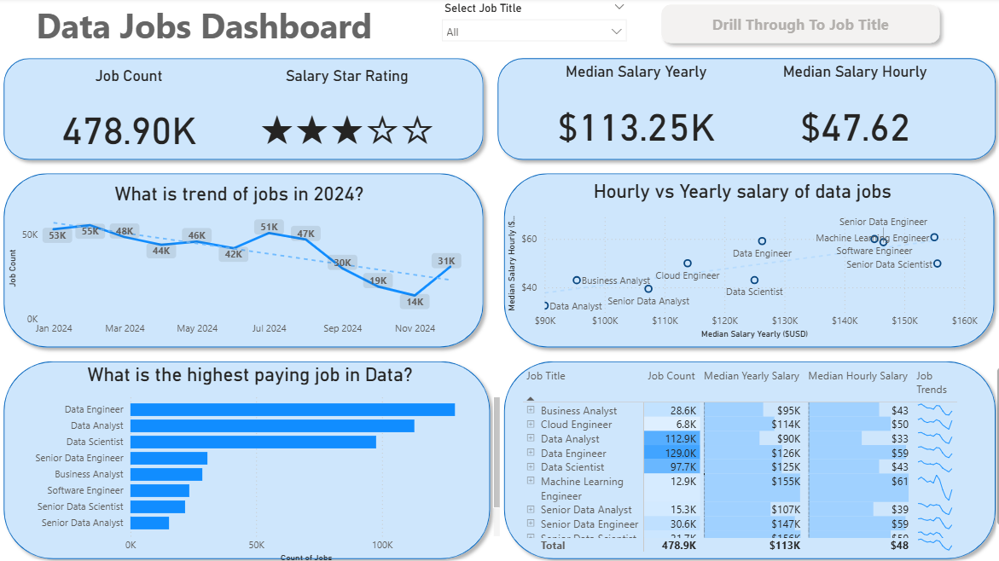
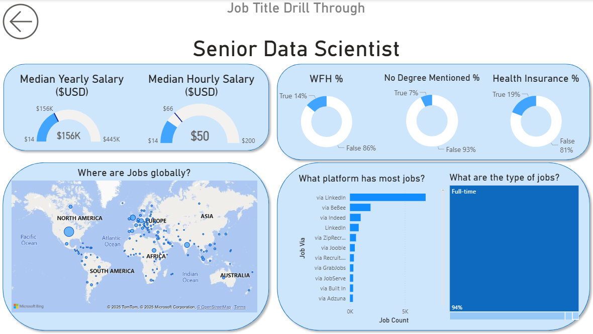

# 📊 Data Science Job Market Analysis (2024)

   
</a>

---

## 📝 Project Objective

Navigating the modern data job market can be challenging due to fragmented information. This dashboard was designed to empower **job seekers and career pivoters** by consolidating scattered data into a single, actionable resource. 

Leveraging a real-world dataset of 2024 job postings, this project offers a clear window into market trends, salary benchmarks, and geographical opportunities within the data industry.

### 📂 Source File
Access the raw Power BI file here: [`Data_Jobs_Dashboard.pbix`](Data_Jobs_Dashboard.pbix).

---

## 🛠️ Technical Skills & Tools

Building this report involved an end-to-end application of core Power BI capabilities, focusing on both backend data processing and frontend user experience.

- **⚙️ ETL & Data Preparation (Power Query):** Performed comprehensive data cleaning and transformation. This included handling missing values, standardizing data formats, and engineering new columns to ensure the dataset was analysis-ready.

- **🧮 DAX & Quantitative Analysis:** Moved beyond basic aggregations to create measures that calculate vital KPIs, such as `Median Yearly Salary` and total `Job Volume`.

- **📊 Data Visualization:** Implemented a diverse set of visuals—including **Column, Bar, Line, and Area charts**—to effectively communicate trends and comparisons across different dimensions.

- **🗺️ Geospatial Intelligence:** Integrated **Map visuals** to illustrate the global footprint of job opportunities and identify regional hubs.

- **🔢 KPI Tracking:** Utilized **Cards** for high-level metrics and interactive **Tables** for granular, sortable data views.

- **🎨 UI/UX Design:** Focused on a clean, intuitive layout that balances standard reporting practices with engaging visual storytelling.

- **🖱️ Advanced Interactivity:**
    - **Dynamic Slicers:** Enabling users to filter data specifically by Job Title.
    - **Navigation Features:** Using Buttons and Bookmarks to build a seamless, app-like experience.
    - **Drill-Through:** Configured deeper navigation paths, allowing users to move from broad summaries to specific context.

---

## 🔎 Dashboard Structure

*The report is organized into two primary views to facilitate both broad market analysis and specific role deep-dives.*

### 1. Market Overview (Executive Summary)

Serving as the "Mission Control" for the analysis, this page provides an executive summary of the market. It highlights essential KPIs—such as total posting volume, salary benchmarks, and trending job titles—offering users an immediate pulse on the industry.

### 2. Job Role Deep-Dive (Drill-Through)

Designed for specific inquiries, this view is accessed via the drill-through function. It breaks down data for individual job titles, presenting detailed metrics on:
- Salary distributions.
- Remote work (WFH) availability.
- Top hiring platforms.
- Geographical hotspots for specific roles.

---

## 💡 Conclusion

This project demonstrates the power of Power BI in converting raw, unstructured job posting data into actionable career intelligence. By combining data modeling with interactive design, the dashboard empowers users to slice through noise and focus on the insights that matter for their career trajectory.